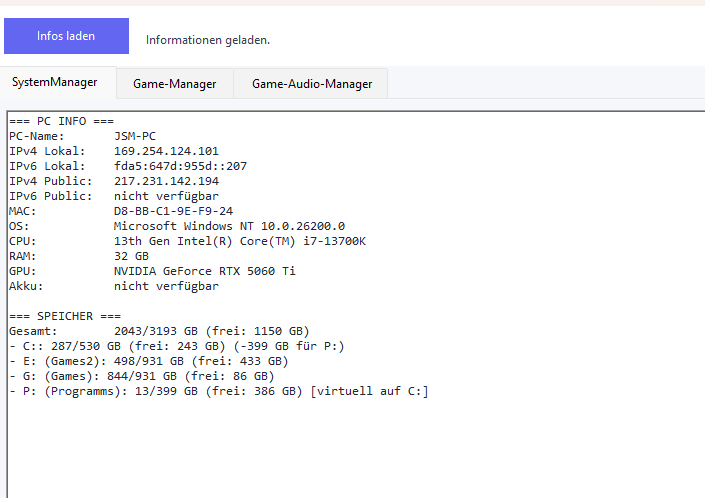
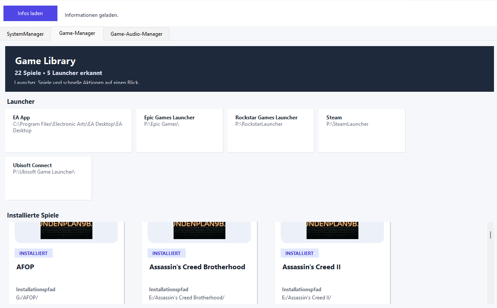

## System & Game Manager
The project is mainly designed to send information to my Smart Home API. However, it should also work for other purposes.
Its also in plan that you can manage Music while you play a game. 
So if there are conversations music will go silenter.
Or if backgroundmusic is playing, your Spotify music goes off.

### Vorschau

**System-Manager**

---

**Game-Manager**

